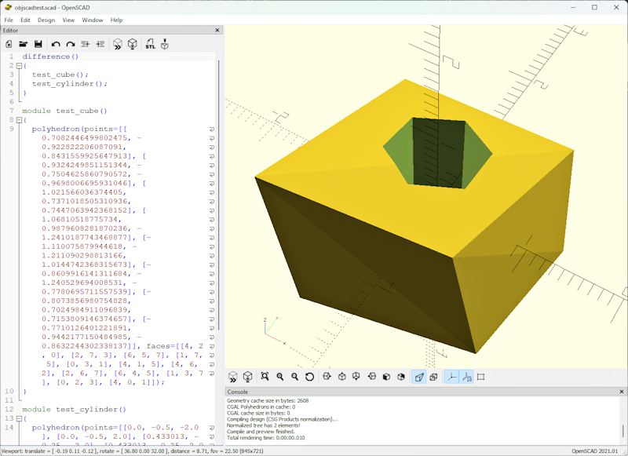

# OBJ to OpenSCAD bridges using Python 3

This is the code from a [Parth3D.co.uk](https://parth3d.co.uk/) blog post that shows how to create basic Python code to bridge between modelling in Blender and OpenSCAD using OBJ files. It includes being able to dynamically produce constructive solid geometry SCAD code, and the ability to apply vertex-level operations, between the two apps.

The code here was provided in a Parth3D blog post which you can find at the following URL:

[************]()

Here's an example of the output: a cube with random jitter added to the vertices and with a hexagonal hole created using a difference operator.

