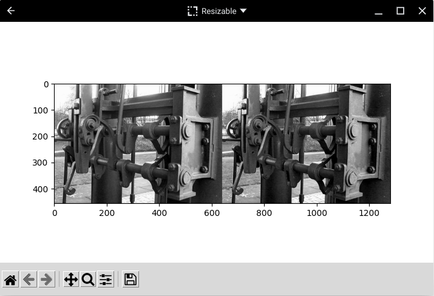

# Splitting anaglyphs to side-by-side images using Python 3

Here you find a code example from [Parth3D.co.uk](https://parth3d.co.uk/) that shows how to split an anaglyph into left and right views, and combine them to a side-by-side image, in Python 3 using the Python Imaging Library Pillow. It has been tested on Android using PyDroid3 so should also be suitable for mobile coding.

The code here was provided in a Parth3D blog post which you can find at the following URL:

[https://parth3d.co.uk/splitting-anaglyph-images-in-python](https://parth3d.co.uk/splitting-anaglyph-images-in-python)

And here's an example of the output: a side-by-side image of an old engine in Birmingham, UK.

