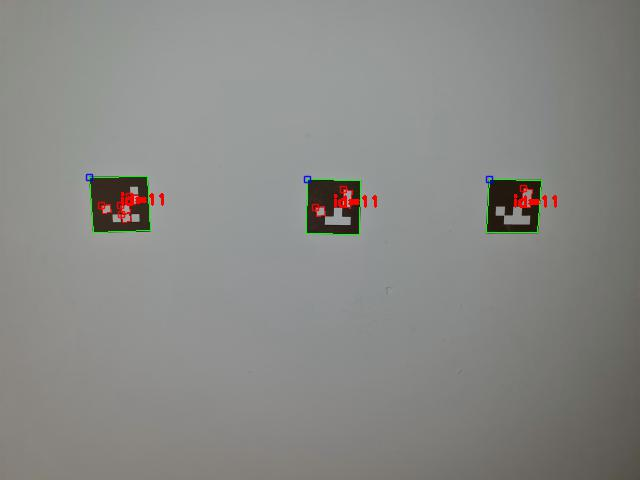

# 3D printing Aruco tags with Python 3 and OpenSCAD

Here you find a code example from [Parth3D.co.uk](https://parth3d.co.uk/) that shows how to create an OpenSCAD file from Python 3, using OpenCV, to generate a 3D printable Aruco tag. It has been tested on Android using PyDroid3 so should also be suitable for mobile coding.

The code here was provided in a Parth3D blog post which you can find at the following URL:

[[https://parth3d.co.uk](https://parth3d.co.uk/3d-printing-aruco-tags-with-python-and-openscad)]([https://parth3d.co.uk](https://parth3d.co.uk/3d-printing-aruco-tags-with-python-and-openscad))

And here's an example of the output: 3D printed Aruco tags detected by OpenCV.

