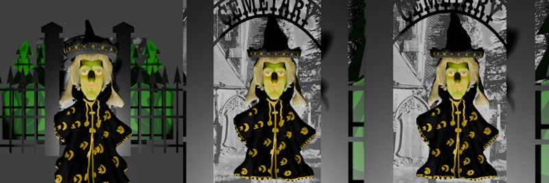

# Dolly zooms in Blender using BPY and Python

Here you find a code example from [Parth3D.co.uk](https://parth3d.co.uk/) that shows how to render a short movie demonstratting how to create a dolly zoom effect with Python/BPY.

The code here was provided in a Parth3D blog post which you can find at the following URL:

[https://parth3d.co.uk/dolly-zooms-in-blender-using-bpy-and-python](https://parth3d.co.uk/dolly-zooms-in-blender-using-bpy-and-python)

Some sample frames from the start, middle and end of the rendering are shown below, illustrating how the subject (the witch) stays the same size, but the background appears to zoom in and out over time.

