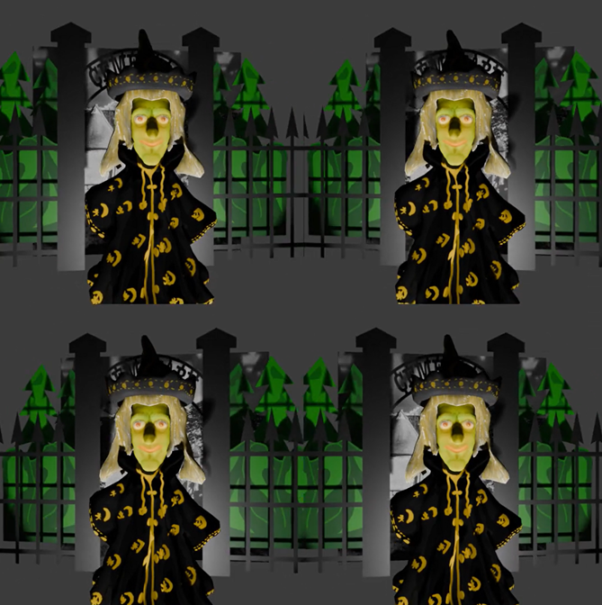

# Stereoscopic camera settings in Blender Python

Here you find a code example from [Parth3D.co.uk](https://parth3d.co.uk/) that shows how to access and change stereoscopic camera settings using Blender Python (BPY).

The code here was provided in a Parth3D blog post which you can find at the following URL:

[https://parth3d.co.uk/stereoscopic-camera-settings-in-blender-python](https://parth3d.co.uk/stereoscopic-camera-settings-in-blender-python)

The Python code is an example of how to control stereoscopic camera settings in Blender Python (BPY) and creates a short 3D movie showing a dolly zoom. It illustrates change in stereoscopic depth with camera distance during zoom.

