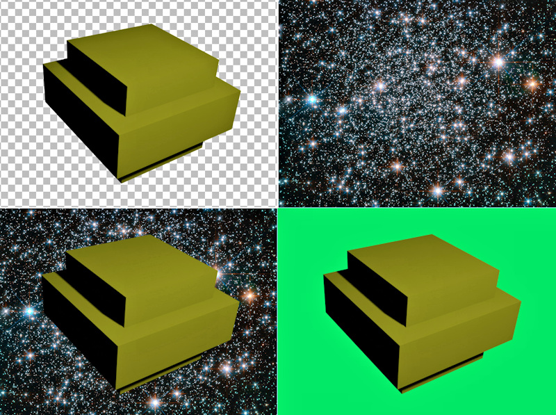

# Creating transparent backgrounds in Blender 3 renders from a Python script

Here you find a code example from [Parth3D.co.uk](https://parth3d.co.uk/) that shows how to make the background of a Blender 3 render transparent (for compositing and chroma-keying) from within a Python script.

To use the example code simply create a new scene-file with Blender 3, with a default cube, camera and light. You should get that just by opening Blender as it's usually what the default scene includes. The 'backgroundtest.py' script can then be run from the Blender scripting layout. When run it will create a render and save the image with transparency to the same folder as the scene file (so remember to save the scene first).

The code here was provided in a Parth3D blog post which you can find at the following URL:

[https://parth3d.co.uk/transparent-backgrounds-in-blender-python-scripts](https://parth3d.co.uk/transparent-backgrounds-in-blender-python-scripts)

And here's a simple example of what the code offers.

