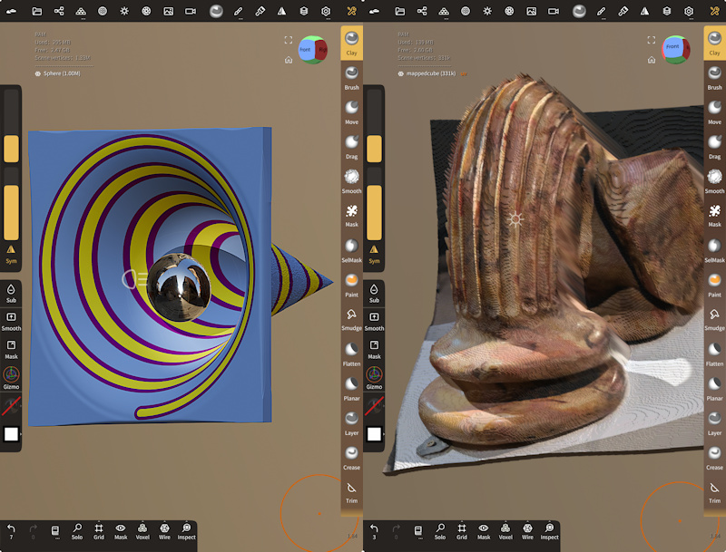

# Making textured 3D digital assets using depth maps and Python 3

This is an update of a simple piece of Python 3 code that can be used to create Wavefront OBJ and MTL files from images, so they can be mapped onto 3D cubes, now with the addition of adjusting the depth of vertices using a monochrome depth map image. The results can then be imported into Nomad Sculpt, or Blender, as photo assets for adding to scenes for 3D rendering.

The code was written for a Parth3D blog post that you can read at the link below:

[https://parth3d.co.uk/making-textured-3d-digital-assets-using-depth-maps-and-python-3](https://parth3d.co.uk/making-textured-3d-digital-assets-using-depth-maps-and-python-3)

Below is a screenshot showing the two examples included in the code after import into Nomad Sculpt on iOS.

# Credits

One of the examples is based on a photo of a lovely 1968 sculpture by Mervyn Baldwin at the [Newport Museum and Art Gallery](https://www.newport.gov.uk/heritage/en/Museum-Art-Gallery/Museum-Art-Gallery.aspx) in South Wales entitled 'A column fallen under its own stone'. The depth map for that image was made using the [Looking Glass Blocks web app](https://blocks.glass).
