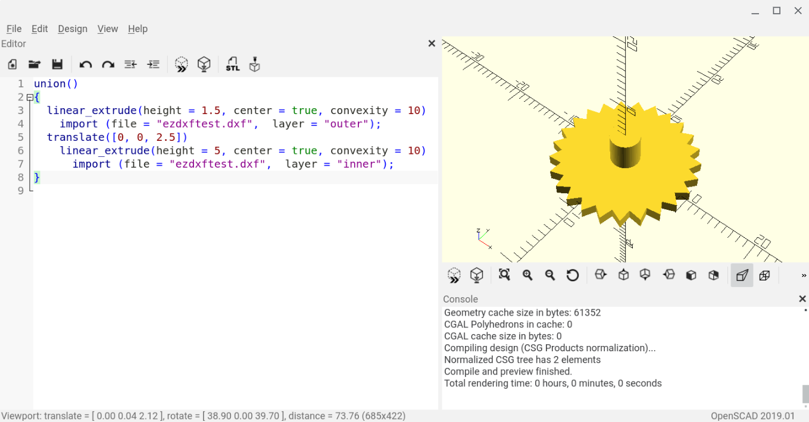

# Creating DXF files for use in OpenSCAD from Python 3

Here you find a code example from [Parth3D.co.uk](https://parth3d.co.uk/) that shows how to create a 2D section through a cog and export it to a DXF file, using the EZDXF library, for extruding to a 3D geometry. It includes a Python 3 script and accompanying OpenSCAD code. It has been tested on Android using PyDroid3 and ScorchCAD, so should also be suitable for mobile coding.

The code here was provided in a Parth3D blog post which you can find at the following URL:

[https://parth3d.co.uk/openscad-with-ezdxf-and-python3](https://parth3d.co.uk/openscad-with-ezdxf-and-python3)
