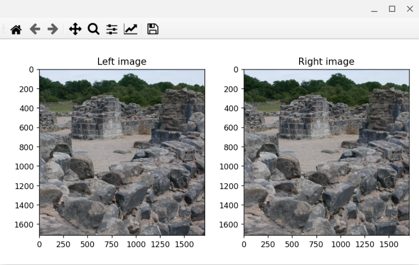

# Opening MPO 3D photos using Pillow in Python 3

Here you find a code example from [Parth3D.co.uk](https://parth3d.co.uk/) that shows how to open an MPO file in Python 3 using the Python Imaging Library Pillow, and how to extract the left and right views from the 3D photo.

The code here was provided in a Parth3D blog post which you can find at the following URL:

[https://parth3d.co.uk/opening-mpo-3d-photos-in-python](https://parth3d.co.uk/opening-mpo-3d-photos-in-python)

And here's an example of the output: left and right eye views of part of Bordesley Abbey ruins in the English Midlands.

