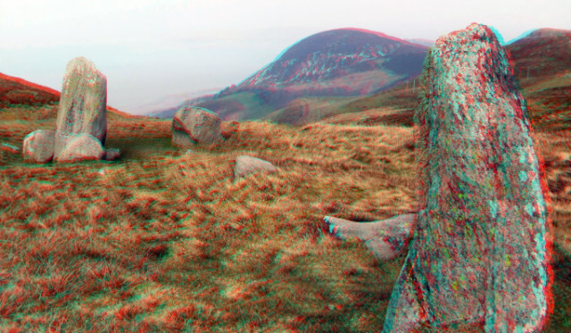

# Converting side-by-side (SBS) 3D images to anaglyphs using Python 3

Here you find a code example from [Parth3D.co.uk](https://parth3d.co.uk/) that shows how to convert a side-by-side (SBS) image to a red/cyan anaglyph in Python 3 using the Python Imaging Library Pillow. It has been tested on Android using PyDroid3 so should also be suitable for mobile coding.

The code here was provided in a Parth3D blog post which you can find at the following URL:

[https://parth3d.co.uk/side-by-side-3d-to-anaglyph-in-python-3](https://parth3d.co.uk/side-by-side-3d-to-anaglyph-in-python-3)

And here's an example of the output: an anaglyph of part of Druids Circle in North Wales.

