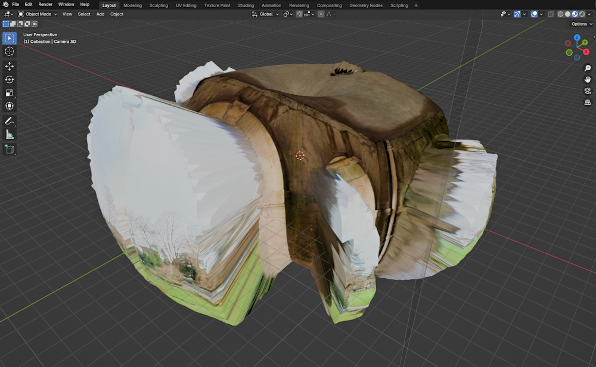

# Converting VR360 images and depth maps to OBJ files using Python 3

This is a repository for a Python 3 example of how to create spherical 3D models from 360-degree photos. It allows the sphere vertices to be adjusted using a depthmap image, which in the example here was created using [Looking Glass Blocks](https://blocks.glass/). The adjusted sphere is then saved to an OBJ file for importing into 3D software such as Blender.

Two Python files are included. One, called objfile.py, is a small library for saving to OBJ files. It is used by the main simple_texball.py file, which when run should create an OBJ and MTL file in the same folder you placed the code in. Those files will automatically include details of the image file simpletexball_rgb.jpg as the image to render over the 3D shape. The vertices of the sphere in the OBJ file will have been adjusted to accord with simpletexball_depth.jpg, which is a monochrome depth map image. For your own images you can change the code to have different starting radius, end radius and depthmap dimensions.

A view of the outside of the depthmap-adjusted sphere, with texture image visible, is shown below in Blender. The code uses quads for construction of the sphere so you can enable smooth shading for the sphere, and then you should get reasonable quality from renders.

The code is from a Parth3D blog post and you can access it at the link below:

[https://parth3d.co.uk](https://parth3d.co.uk).

Credits: Please note that the 360-degree photo used here was taken at the lovely [Parc Howard in Llanelli](https://www.discovercarmarthenshire.com/places/llanelli-the-millennium-coastal-park/parc-howard-museum-gardens), so please make sure you visit them in south Wales to say hello!
